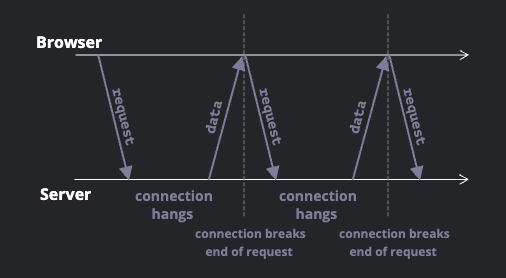

# Noom

Zoom 클론 코딩으로 WebRTC + WebSockets 익히기. 

## 몰랐던 것 정리 노트

### Socket.io는 WebSocket의 구현이 아니다.

- Socket.io는 양방향 실시간 통신에 웹소켓을 사용하지만, 웹소켓을 사용할 수 없는 환경에서는 다른 기술(`HTTP Long-polling` 등)을 사용하여 동작한다.
- [Ref](https://socket.io/docs/v4/#what-socketio-is-not)

### HTTP Polling & Long-Polling

- Socket.io가 웹소켓을 사용할 수 없을 때 쓴다는 `HTTP Long-Polling`은 무엇일까?
- **Regular Polling**
  - 서버와 지속적으로 통신할 수 있는 가장 간단한 방법.
  - 클라이언트가 정해진 시간 간격으로 서버로부터 새로운 정보를 요청하는 것.
  - 대규모 서비스나 요청 데이터의 용량이 큰 경우 성능에 좋지 않은 방법이다.
- **Long Polling**
  - 일반적인 Polling과는 다르게 지연 없이 요청을 보내는 방법.
  - 클라이언트에서 서버로 요청을 보낸 후 무기한 대기한다.
  - 서버는 새로운 정보가 생기면 클라이언트에게 응답을 보낸다.
  - 클라이언트는 응답을 받는 즉시 새로운 요청을 보낸 후 무기한 대기한다.

|  |
| :--------------------------------------------------: |
| [Ref: 모던 자바스크립트](https://ko.javascript.info) |

```js
// 브라우저에서 Long Polling을 구현하는 subscribe 함수.

async function subscribe() {
  let response = await fetch("/subscribe");

  if (response.status == 502) {
    // 요청이 timeout되거나, 서버가 닫혔다면 요청을 다시 보냄.
    await subscribe();
    return;
  }
  if (response.status != 200) {
    // 에러 핸들링 후 요청을 다시 보냄.
    showMessage(response.statusText);
    await new Promise((resolve) => setTimeout(resolve, 1000));
    await subscribe();
    return;
  }
  // 요청 성공 시 요청 받은 데이터를 보여주고 다시 요청을 보내서 서버의 응답을 기다림.
  let message = await response.text();
  showMessage(message);
  await subscribe();
}

subscribe();

// Ref: 모던 자바스크립트, https://ko.javascript.info
```

- 단, 응답을 받고자 하는 서버가 `pending` 상태의 여러 응답을 다룰 수 있는 구조여야 한다.

### HTML 전역 속성 hidden

- `hidden` 전역 속성은 브라우저가 해당 속성이 있는 엘리먼트를 렌더하지 않도록 한다.

```html
<h1>보이는 제목</h1>
<h1 hidden>보이지 않는 제목</h1>
```

- `hidden` 속성은 **hidden**과 **until found**라는 두 가지 상태를 가질 수 있다.
  - `hidden` 키워드를 사용하면 hidden 상태가 된다.
  - `until-found` 키워드를 사용하면 until-found 상태가 된다.
  - 그 외 다른 문자열을 할당하거나 빈 문자열을 할당하면 hidden 상태가 된다.

```html
<h1 hidden>보이지 않는 제목</h1>
<h1 hidden="hidden">역시 보이지 않는 제목</h1>
<h1 hidden="hello world">역시 보이지 않는 제목</h1>

<h1 hidden="until-found">유저가 이 요소를 찾기 전까지 보이지 않는 제목</h1>
```

- 단지 화면에서만 숨기기 위해서(실제로는 필요하지만) `hidden` 속성을 쓰면 안 된다. `hidden` 속성으로 가려진 요소는 스크린 리더에서도 감지하지 못하기 때문이다.
- 숨겨진 요소는 숨겨지지 않은 요소를 통해 접근 가능해서는 안 된다(숨겨진 요소를 `href`로 링크해놓는다던지).
- 웹 브라우저는 CSS의 `display: none` 속성을 사용하여 HTML의 `hidden` 속성을 구현할 수도 있다. 따라서 `hidden` 속성을 가진 요소에 CSS를 통해 `display` 속성을 별도로 설정하면 해당 요소는 HTML의 `hidden` 속성을 무시하고 CSS에서 설정한 대로 화면에 나타날 수 있다.
- `until found` 상태는 기본적으로 해당 속성이 할당된 요소를 숨겨두고, `a` 태그 등으로 유저가 해당 요소에 접근하려고 할 때 그 요소를 보여주게 되는 상태이다.
  - 브라우저는 다음의 단계를 거쳐 해당 기능을 구현한다.
    1. 해당 요소에 `deforematch` 이벤트를 발생시킨다.
    2. 해당 요소의 `hidden` 속성을 제거한다.
    3. 해당 요소로 스크롤을 이동한다.
  - 대부분의 브라우저는 until found 상태를 CSS의 `content-visibility: hidden` 속성을 통해 구현한다.
    - unfil found 상태는 hidden 상태와는 다르게 박스 레이아웃을 유지한다.
    - 즉, until found 상태에서 요소는 페이지 레이아웃을 차지한다.
    - 또한 `margin`, `borders`, `padding`, `background` 속성 역시 렌더링된다.
- [Ref: MDN](https://developer.mozilla.org)

### Enumerated attribute(열거된 속성)

- HTML 요소의 전역 속성인 `hidden`은 **enumerated attribute**이다.
- 컴퓨터 사이언스에서 enumerated type이란 고정된 값들의 집합으로 이루어진 데이터 타입이다.
- HTML에서 enumerated attributes란 미리 정의된 텍스트만을 값으로 가질 수 있는 속성을 말한다.
- `hidden` 속성은 `hidden`, `until-found`만을 값으로 가지며, 그 외의 모든 문자열은 `hidden` 키워드 값과 똑같이 처리된다는 점에서 `enumerated attribute`이다.
- [Ref: MDN](https://developer.mozilla.org)